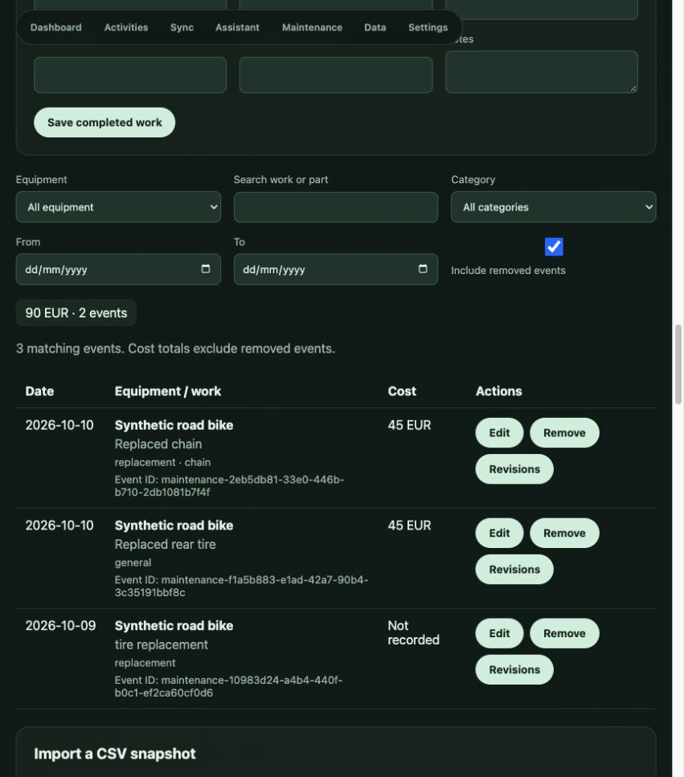

# T11 verification — 10 October 2026

T11.1–T11.8 are implemented. Maintenance uses the existing local SQLite database, scoped application services and a dedicated screen. No new paid dependency is required.

## Behavior

- Equipment labels are created as needed. Completed events require equipment, work and date; parts, quantity, cost/currency, provider, manual usage/units and notes are optional. Stable IDs and revision snapshots persist.
- Common English maintenance chat commands resolve locally for either selected provider, even without a configured provider. Clear logging saves and displays Edit/Undo; missing essentials produce durable targeted clarification. Relative dates use the supplied app timezone. Questions, planned/hypothetical and negated work do not create completed records. Multiple clear entries are supported; shared costs are not duplicated.
- Validated log/list/update/undo/export tools use atomic operations, durable request identities and stale-edit protection. Model-generated write calls are rejected; imported or quoted notes cannot authorize another action. Chat retries retain the same saved result or clarification.
- Maintenance provides date/equipment/category/search filters, all optional edit fields, full revision details, recoverable removal/restoration, currency-separated totals, CSV download, mapping/preview and explicit conflict choices. CSV imports can be undone and reject stale previews. Columns are documented in `../maintenance-csv.md`.
- Versioned JSON exports include equipment/events/revisions. Full backups preserve records, revisions, operation identities and pending state; restoration retains subsequent Undo behavior.

## Verification

`make test`: 120 backend tests and TypeScript checks pass. `make build`: production frontend build passes.

The 23 maintenance tests cover validation and all optional fields, atomic batches, case-insensitive labels, concurrent retries, distinct similar events, stale revisions, sequential Undo, remove/restore, filtered currency totals, timezone/year boundaries, clear and ambiguous chat, progressive clarification, action replies, multiple entries/shared cost, future/negated requests, notes injection, blocked model writes, provider-independent streaming, API integration, CSV Unicode/quoting/formula safety, mapping/invalid rows/deduplication, conflicts/stale preview/import Undo, and JSON/full backup restoration.

Browser checks used `/private/tmp/garmin-t11-ui`, a separate synthetic database: form log/edit/Undo, direct chat log, equipment clarification and follow-up, cost correction, reviewed CSV conflict import and Undo, removal/restoration and revision inspection all passed. Test servers were stopped afterward. The real database was unchanged by these checks: 1,065 activities and 52,514 metric readings.

## Boundaries

The local parser supports common explicit English commands and ISO/today/yesterday completion dates. Unrecognized phrasing may require a focused follow-up or the Maintenance form. Chat messages remain page-session-only; records and pending clarification state are durable. Automatic service reminders, Garmin-derived equipment mileage and live external CSV synchronization remain outside T11. T6 live OpenAI verification still needs an API key; maintenance commands themselves do not call either model.
