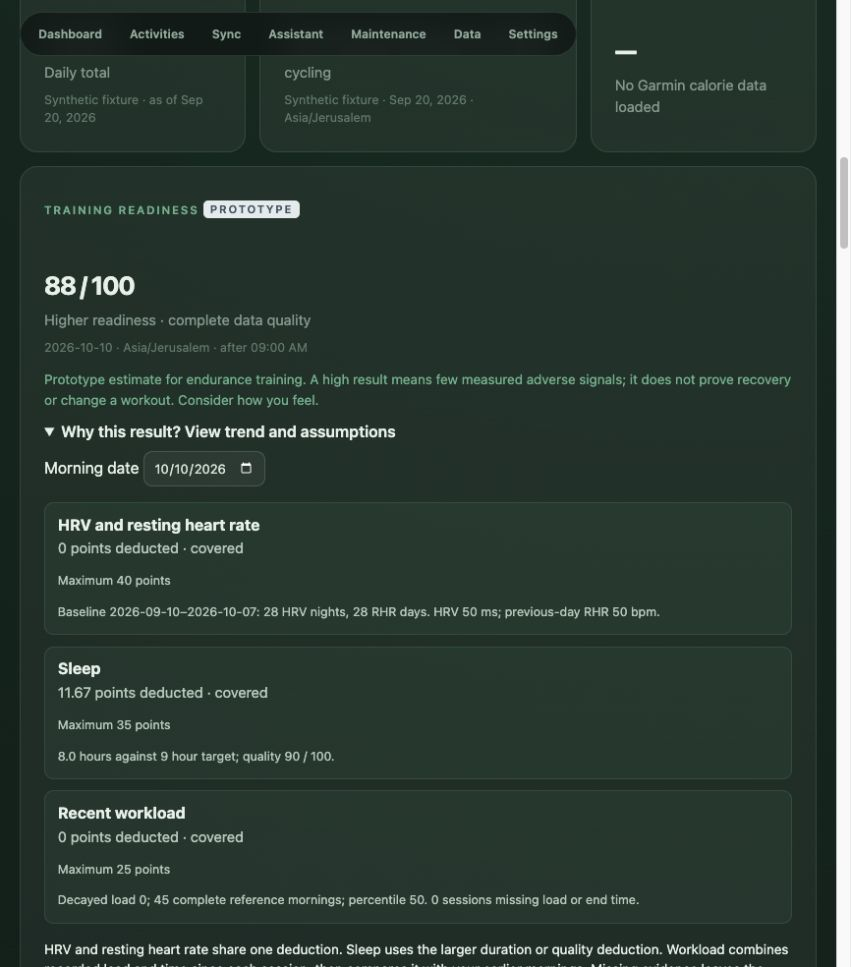

# T12 readiness prototype verification

Verified 10 October 2026. The implementation is complete as a transparent, advisory prototype. Its numerical calibration and predictive usefulness are not scientifically validated. Prospective normal-use feedback remains future work.

## Behavior

`readiness-v1` combines three bounded deductions: autonomic deviations (40 points), sleep shortfall/quality (35), and unusually high recent workload (25). Correlated HRV/RHR and sleep duration/score each use a maximum within their group. All parameters are visible and editable; budgets must sum to 100 and ranges/minimum history are validated. Missing evidence retains the fixed unknown budget, yielding a range or insufficient data rather than a fabricated high score.

HRV uses log overnight averages against a prior 28-day median/MAD reference with at least 21 nights, excluding the recent three-night window. Resting HR uses the previous completed day's whole-day value and its own baseline; today's whole-day summary is excluded. This lagged context is a deliberate timing choice, not an assertion that Garmin reports an isolated morning RHR.

Sleep is dated by its recorded wake time in the selected IANA timezone. The cutoff is the later of the configured morning hour (default 08:00 local) and recorded wake time. Unfinished/future observations are labeled awaiting morning. Current-night sleep and a meaningful HRV reference are required for even a partial range; the latest historical observation is never substituted for today.

Workload includes sessions finished before the cutoff, with a seven-day lookback and a provisional 36-hour exponential half-life. Recorded activity ends, FIT session ends, or Garmin elapsed duration resolve timing; active duration alone is not guessed into an end timestamp. References are the preceding 56 mornings, requiring at least 28 fully covered mornings. Activity verification must include the observation date because an early workout may have finished that morning. Missing source loads/end times and unverified dates keep this group incomplete. Explicit zero load and verified no-workout dates are valid.

Complete results include sensitivity checks for 24/48-hour half-lives, sleep targets ±0.5 hours, alternative group budgets, and HRV/RHR tolerance changes. Band changes are flagged separately from data completeness. These checks assess stability, not predictive validity.

## Storage and integration

Migration 015 stores immutable parameter versions and calculation snapshots keyed by date, timezone, configuration and input/result fingerprint. Repeat queries reuse snapshots; corrections create a new calculation while preserving the old result. Historical queries can request an existing configuration version. Formula upgrades must explicitly support their version; unknown versions fail rather than silently reinterpret history.

The dashboard's fourth card supports hide/reorder, expands into deductions/input dates/personal references, displays a 14-morning trend and partial ranges, and provides a parameter form. It refreshes after sync changes. The card clearly labels the prototype and explains its assumptions. JSON exports and SQLite backups retain configurations and calculation history.

`GET /api/readiness` accepts optional `end_date`, 1–90 `days`, IANA `timezone`, and `config_version`. `/api/readiness/settings` reads and validates parameter updates. `get_training_readiness` returns the same advisory evidence to Qwen/OpenAI. Readiness chat answers are deterministic once the tool is called; the tool does not modify plans. Relative today/yesterday and explicit dates are application resolved.

## Evidence

- 157 backend tests, TypeScript checks, and production build pass. The 22 new readiness tests cover normal/severe/combined evidence, high HRV, correlated deductions, load decay, missing values/references, source units, current/future timing, duplicate source choice, morning-date coverage, wake-date/DST, unknown session ends, monotonicity, correction revisions, parameter history, JSON/backup restoration, API validation and assistant evidence.
- Real local data: 13 of the most recent 14 mornings have sufficient evidence for a complete estimate. Today's calculation uses all three groups and 45 complete workload reference mornings. Real derived values remain in the ignored local database, not this document or screenshots.
- Isolated synthetic browser checks verified the expanded explanation, saving a nine-hour sleep target (100→88), a new parameter version, historical selection from the trend, and partial ranges when workouts lacked load/end data.
- The local Qwen flow returned `start`, `tool`, `delta`, `complete` and the exact synthetic 88/100 result with its deductions and advisory limitation. Live OpenAI remains unverified without an API key; the shared tool and deterministic answer are tested.

Historical values are reconstructions using currently corrected records with past-only references. They are not proof of which records were available at that time. Optional fatigue/soreness check-ins and prospective validation remain later work; a wearable estimate must not override how the person feels or silently alter a workout.
