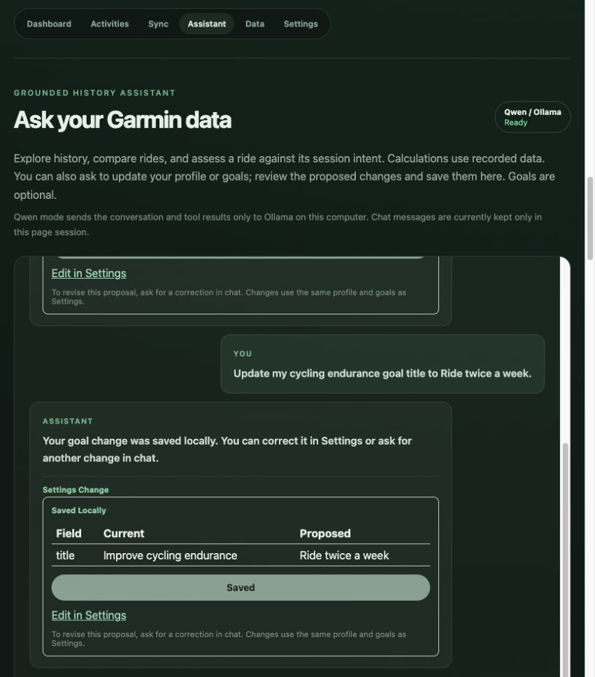

# T6 verification — 10 October 2026

T6 implementation is complete. Live OpenAI verification remains pending because no `OPENAI_API_KEY` is available in the backend environment. No paid fallback is enabled. MCP remains optional and deferred.

## Implemented behavior

- `assess_ride` links the stored reference and reports recorded volume/sensors, active goals as context, current session intent when explicitly supplied, and optional duration-target completion. Unknown intent prompts a question and conditional interpretations. Recovery intensity and interval completion require missing personal zones, effort, and plan targets; one session cannot establish long-term improvement.
- `running_volume_trend` returns consecutive seven-day running bins, first-to-last changes, source activity IDs, and missing-value counts. Empty periods mean no stored runs, not verified inactivity. Dates use the chat's validated timezone.
- `get_training_context` reads existing profile/goals. `propose_settings_change` validates a profile patch or one goal create/update/archive and stores a pending preview. It does not update settings. The model has no confirmation tool.
- `POST /api/ai/settings-changes/{id}/confirm` applies the reviewed snapshot atomically through the same Settings functions. Repeated confirmation is idempotent. Changes made since the preview reject the stale proposal. The UI refreshes Settings and reports what was saved.
- Goal revisions preserve initial and changed target states, including form changes; full SQLite backups retain them and saved action identities.
- Tool routing constrains effectiveness/weekly-volume/settings requests. Qwen has one bounded validation retry for malformed settings arguments. Unsupported fields, invented goal IDs, nonfinite numbers, SQL/shell/write tools, and unrequested settings proposals are rejected. Imported strings remain data.

## Evidence

`make test`: 97 backend tests pass plus TypeScript checks. `make build`: production frontend build passes.

Tests include independent eight-week volume values, missing sensors/values, unknown/explicit intent, duration-target completion, injected imported activity names, invalid operations, duplicate confirmation, goal correction/archive, stale form edits, API confirmation, persistence after reopening and backup restoration, Qwen tool-name constraints/retry, and mocked OpenAI review behavior. A course-comparison regression verifies sensors from matched attempts outside the displayed limit. Parallel fresh-start checkpoint initialization is now conflict-safe.

Live Qwen 3.5 2B completed five flows against temporary synthetic storage: ride effectiveness, eight-week running volume, goal creation, goal-title correction, and profile-weight update. Creation, correction, and profile confirmation persisted expected values. The browser verified pending previews, explicit Save change, saved feedback, and immediate goal updates in Settings.

## Remaining boundaries

OpenAI has SDK/tool/stream/action coverage with mocks; a live request needs a user-supplied backend API key. Session plans, training availability/equipment/restrictions, personal zones, nutrition questions, and maintenance actions belong to their later tasks. Current assessments describe the recorded session and uncertainty; they do not invent a completed training plan. Chat history remains page-session-only, while confirmed profile/goals and revision records are durable.
