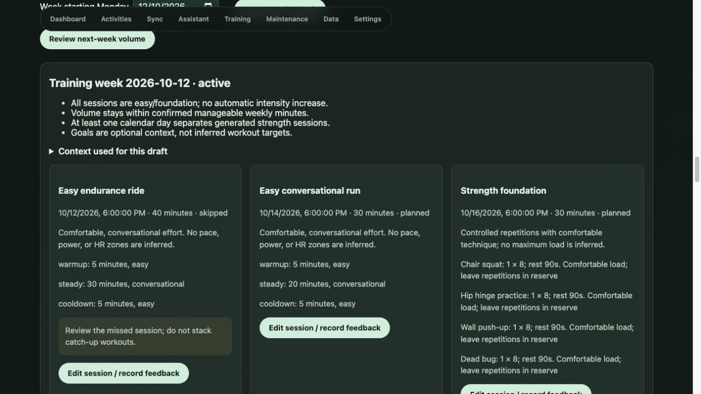

# T7 verification — 10 October 2026

T7.1–T7.6 are implemented for the documented foundation-template scope. See [rules and limits](../planning/training-rules.md).

- Migration 016 adds saved preferences/confirmations and immutable revisions, session completion status, session revisions and feedback. API services enforce stale revisions and atomic writes.
- Training UI saves/reuses questions, creates and accepts reviewable weekly drafts, displays rationale/history/readiness context, supports template/duration edits and feedback, and separately reviews/saves future volume limits.
- Assistant planning requests retrieve saved questions/constraints and direct the user to the reviewed Training flow. AI cannot silently create a calendar.
- `make test`: 177 backend tests and TypeScript pass. T7 adds 20 cases for freshness, strict inputs, contradictory restrictions, unavailable equipment, optional goals/profile, exact timings, zero volume, conflict rollback, priority, recovery across week boundaries, six-session cap, restored-session conflicts, stale revisions, feedback, progression, portability, API isolation and DST.
- `make build`: production build passes.
- Isolated synthetic browser database: generated all three sports, accepted the draft, edited cycling from 45 to 40 minutes, recorded a skipped session, verified the review/catch-up message and unchanged other sessions, and reviewed the explicit volume proposal. Screenshot below contains synthetic data only. Browser checks cover the main workflow; latest boundary rules are covered by service tests.

## Data isolation and limitations

An initially incorrect API-test mock reached the local database. The mock now overrides the actual bound database function. Exactly identified synthetic preferences/plan/workouts and unintended readiness settings/calculations were removed and the eight-hour readiness default restored. All tests now use temporary databases. Final real-data counts remain 1,065 activities, 56,843 metric readings and 2,937,459 sensor samples, with zero training preferences/plans and no foreign-key violations. Actual U6 answers were not invented or saved.

Numeric planning rules are provisional, not prospectively validated. Goals, recorded history and current readiness supply review context rather than automatic intensity/target prescriptions. Date rescheduling and advanced periodization remain future extensions. Garmin publication is T8. A live model-driven T7 conversation was not rerun; deterministic tools and API contracts are tested. All changes remain local and uncommitted.
