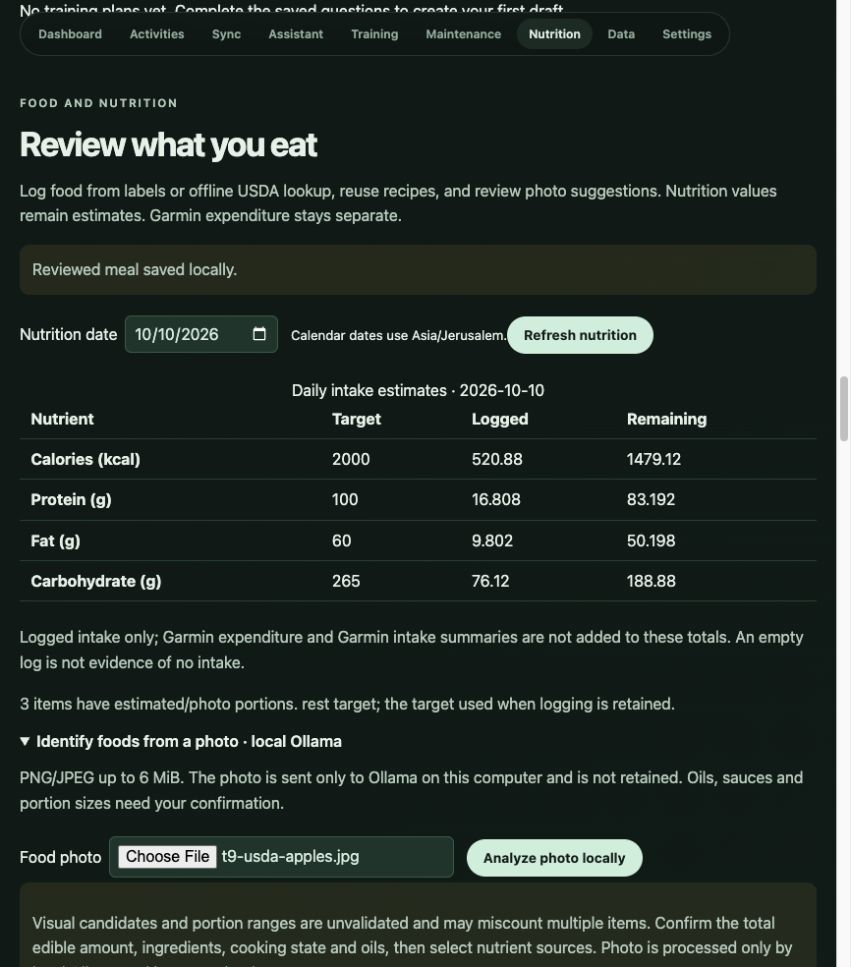
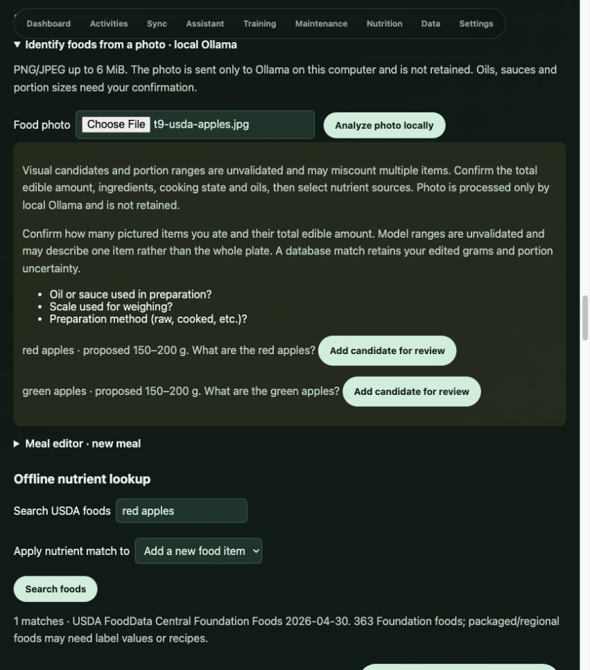

# T9 verification — 10 October 2026

T9.1–T9.6 are implemented for the local nutrition prototype, with the evidence boundaries below. See [methods and assumptions](../planning/nutrition-methods.md).

## Delivered

Migration 017, nutrition services and validated APIs, offline public USDA lookup, manual foods, recipes/reusable meals, editable reviewed meal saves, recoverable removal, immutable revisions, partial-aware daily totals, adult maintenance/manual target previews, target history/day snapshots, and local photo candidate review. Meals have a separate CSV; imported Garmin summaries remain a separate dataset. JSON and full backup retain the new module. Actual U8 preferences/targets are supplied during use.

## Verification

- `make test`: 199 backend tests plus TypeScript pass. The 22 new nutrition cases cover labeled and USDA portions, per-100g edits, negative/missing source values, strict validation, retries, immutable corrections, remove/restore, local dates/DST, recipe scaling/revisions, partial recipes, maintenance calculations, manual targets/stale writes, frozen day targets, local training-day overrides, partial remaining values, JSON/CSV/backup restoration, isolated API confirmation, local vision schema/limits/failure handling and no automatic model writes.
- `make build`: production build passes. `git diff --check` passes.
- Rebuilt the public USDA catalog from the official 458 KiB ZIP: 363 nonempty foods, 311 complete kcal/macronutrient records, 10 flagged negative carbohydrate observations retained as unknown. Release/checksum and a reproducible bounded builder are included.
- Isolated synthetic browser database: saved a 2000 kcal manual target; reviewed/saved a 200 kcal label meal, corrected it to 250 kcal; saved a two-serving recipe, loaded/logged one serving (125 kcal); looked up hummus, reviewed 50 g (114.5 kcal), corrected to 20 g (45.8 kcal), removed/restored it. Daily totals updated correctly.
- Live local Qwen 3.5 2B: a blank image yielded no foods. The [public USDA apple photograph by Scott Bauer](https://www.ars.usda.gov/oc/images/photos/aug02/k7252-25/) yielded red/green apple candidates. Default thinking first exhausted the bounded response; disabling it fixed the JSON response. Browser upload/analyze then displayed the candidates and uncertainties. Added one candidate, explicitly entered a synthetic 180 g portion, selected FDC 1750339 and reviewed/saved 100.08 kcal. The complete synthetic day totaled 520.88 kcal, leaving 1479.12 from its 2000 kcal target. The edited grams and photo uncertainty persisted.
- Browser visual inspection verifies the Nutrition status table, local-only photo explanation, review controls, lookup and saved-meal feedback. Screenshots contain synthetic entries and public reference food names, not personal meals.

## Limits and data isolation

Food-photo mass/count accuracy is unvalidated. The apple photograph contains multiple apples; the model's 150–200 g groups could refer to one item and must not be treated as measured totals. It also asked generic questions; the app independently asks for amount/preparation confirmation. Mixed meals, hidden oils/sauces and actual known-portion photos need normal-use evaluation. Nutrient lookup is a limited Foundation catalog, not comprehensive packaged/regional coverage. Manual labels and recipes remain available offline.

The original photo is not retained. No real nutrition input or target was invented. Tests patch the bound `app.database.database_path`, and browser services use `/private/tmp/garmin-t9-browser`. The real database was not migrated or written by this T9 run; migration 017 will apply at its next normal app launch. Final read-only checks retain 1,065 activities, 56,843 metric readings and 2,937,459 activity samples, zero personal meals/targets, and no foreign-key violations. Temporary app test services are stopped after verification; the user's existing Ollama service is left alone.

Changes remain local and uncommitted. Next is T10 daily-use lifecycle/recovery and normal-use verification. T8 Garmin workout publishing remains last.
